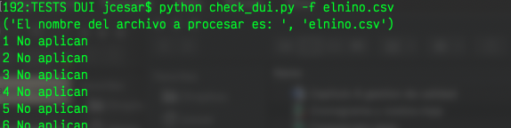
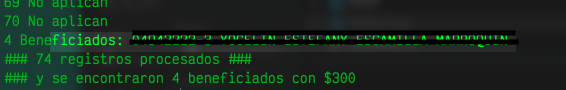

# validate_bono_covid19
Script hecho en **python** para la validacion del bono gubernamental en El Salvador, debido a la emergencia del **COVID19**.

El fin principal es solucionar el programa que tiene algunas instituciones que trabajan tambien en el apoyo a las familias mas necesitadadas, afectados por la pandemia y cuya intencion es focalizar a aquellos que no recibieron esta ayuda, y asi facilitar la depuracion de los beneficiados para otras donaciones.

Como dicha plataforma que ha proporcionado el gobierno no cuenta con una ***API***, especifica para desarrolladores, este escript hace un scraping a la url [https://covid19-elsalvador.com/] en el cual se evalua simplemente si dicha persona es beneficiario o no.

Su fucionamiento es basico solo se debe proprocionar un archivo en formato **CSV**, donde se le proporcione los siguientes datos:

 - Correlativo 	
 - Nombre del jefe de hogar
 - Direccion 	
 - Numeros de Duis necesarios separados 
   por comas (Por familias)

## Requerimientos
python 2.7 en adelante

## Instalacion

Descargar el Script y luego instala las dependencias

> pip install -r requeriments.txt

Luego ejecuta el comando en consola

> python check_dui.py -f filename.csv

Se mostrar el resultado de cada consulta y creara al final un archivo con las personas beneficiadas con el bono.

Queda en la disposicion de cualquier interesado en apoyar iniciativas que beneficien al pueblo salvadoreño, haciendo uso adecuado y racionable ya que podria afectar el rendimiento de la plataforma gubernamental.

